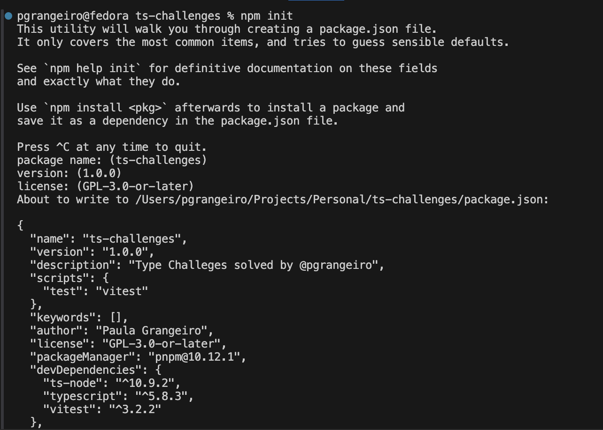

# How to start a new project?

Case you already have npm installed on your computer, type

```
npm init
```

You will be prompted to inform the project data


After confirming the data prompted, the `package.json` file will be created.
